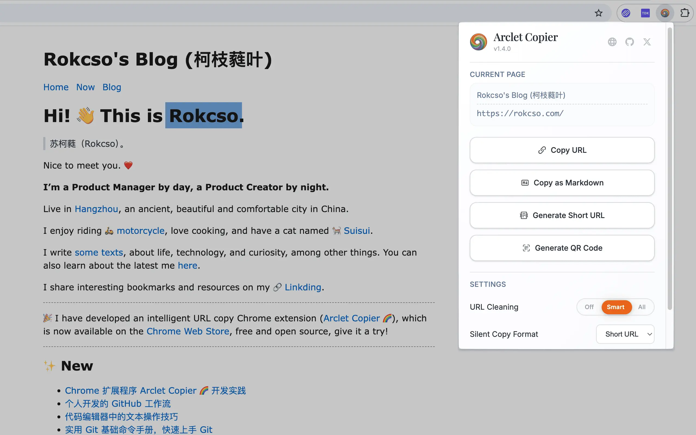
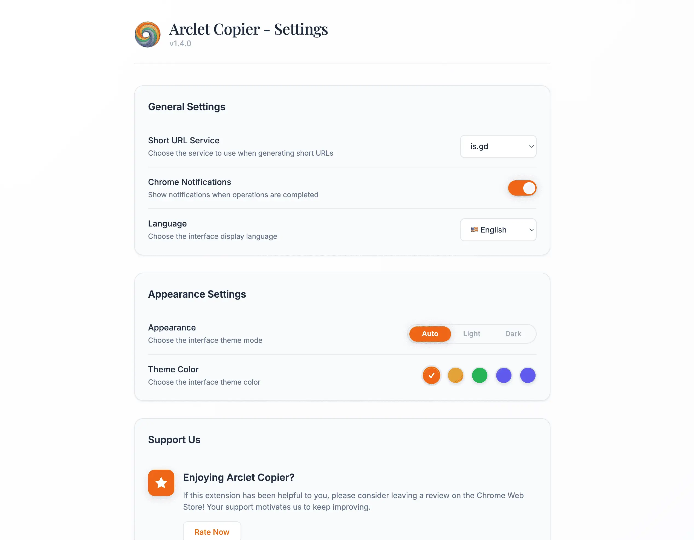

# 🌈 Arclet Copier

快速复制当前页面 URL 的 Chrome 扩展程序，支持参数过滤和 Markdown 链接格式。

## 界面预览

### 弹窗界面


### 设置选项页面


## 功能特色

- 🔗 **一键复制 URL**：支持 popup 点击和快捷键静默复制
- 📋 **批量复制功能**：支持选择多个标签页进行批量URL复制，提供预览功能和智能筛选
- 🔧 **智能参数清理**：三级清理模式（关闭/智能清理/清除所有参数），智能模式仅移除跟踪参数
- 📝 **Markdown 格式**：支持复制为 `[标题](URL)` 格式的 Markdown 链接
- 🌐 **短链生成**：一键生成短链并复制，支持 is.gd 和 TinyURL 服务选择，内置缓存和防抖机制
- 📱 **二维码生成**：为当前页面URL生成二维码，支持复制二维码图片，主题自适应
- ⚙️ **专业选项页面**：独立的设置页面，提供完整的配置选项和更好的设置体验
- 🖱️ **右键菜单**：支持右键菜单"复制当前 URL"，随处可用的快捷方式
- 🌙 **深色主题**：完整的深色主题支持，可跟随系统或手动切换
- 🎨 **多主题色系统**：5种主题色可选（橙、黄、绿、蓝、紫），界面元素和通知颜色统一跟随主题
- ⚡ **快捷键支持**：`Ctrl+Shift+C` (Windows/Linux) 或 `Cmd+Shift+C` (Mac)
- 🌍 **多语言支持**：支持9种语言（简体中文、English、Español、日本語、Deutsch、Français、Português、Русский、한국어），支持动态切换
- 🔔 **通知控制**：可自定义Chrome桌面通知显示，满足不同用户的通知偏好
- 🛡️ **智能处理**：针对 Chrome 系统页面优化，提供友好的用户体验
- 🏗️ **模块化架构**：采用现代ES6模块化设计，代码结构清晰，易于维护和扩展

## 安装方法

### 方法一：直接下载安装

1. **下载扩展程序**
   - 点击右侧 [Releases](../../releases) 页面
   - 下载最新版本的 `arclet-copier.zip` 文件
   - 解压到本地文件夹

2. **Chrome 浏览器安装**
   - 打开 Chrome 浏览器
   - 地址栏输入 `chrome://extensions/`
   - 开启右上角的"开发者模式"
   - 点击"加载已解压的扩展程序"
   - 选择解压后的文件夹

### 方法二：从源码安装

1. **克隆仓库**
   ```bash
   git clone https://github.com/rokcso/arclet-copier.git
   cd arclet-copier
   ```

2. **Chrome 浏览器安装**
   - 打开 Chrome 浏览器
   - 地址栏输入 `chrome://extensions/`
   - 开启右上角的"开发者模式"
   - 点击"加载已解压的扩展程序"
   - 选择项目文件夹

## 使用说明

### Popup 界面操作

1. 点击工具栏中的扩展图标
2. 在弹出界面中：
   - **页面预览**：显示当前页面标题和URL，实时获取页面信息
   - **复制 URL**：复制当前页面链接
   - **复制为 Markdown**：复制为 `[页面标题](URL)` 格式
   - **生成短链**：一键生成当前页面的短链并复制，支持缓存和防抖，避免重复请求
   - **生成二维码**：为当前页面URL生成二维码，支持复制二维码图片到剪贴板，复制后自动关闭弹窗
   - **URL清理**：三段滑块控制（关闭/智能清理/清除所有参数）
   - **静默复制格式**：设置快捷键复制的默认格式（支持URL/Markdown/短链）
   - **Chrome通知**：控制是否显示浏览器桌面通知，可根据个人偏好开启或关闭
   - **外观**：三段滑块控制（跟随系统/浅色模式/深色模式）
   - **主题色**：5种颜色可选（橙、黄、绿、蓝、紫），界面元素和通知颜色统一跟随主题
   - **语言设置**：在9种语言之间切换界面语言（简体中文、English、Español、日本語、Deutsch、Français、Português、Русский、한국어）
   - **高级设置**：点击打开专门的选项页面，配置短链服务等高级选项

### 快捷键操作

- **Windows/Linux**：`Ctrl + Shift + C`
- **Mac**：`Cmd + Shift + C`

快捷键会根据设置中的"静默复制格式"来复制 URL、Markdown 链接或短链。

### 右键菜单操作

在任何网页上右键点击，选择"复制当前 URL"即可快速复制当前页面的URL。右键菜单复制同样会：
- 遵循URL清理设置（关闭/智能清理/清除所有参数）
- 遵循静默复制格式设置（URL或Markdown格式）
- 显示桌面通知确认复制成功

适用场景：页面空白处、文本选择区域、链接上、图片上、视频/音频元素上、输入框中等。

### 批量复制功能

在弹窗界面点击"高级设置"中的批量复制选项，或直接访问批量复制页面：

1. **标签页选择**：
   - 支持按窗口范围筛选（当前窗口/所有窗口）
   - 提供全选、反选、清空等快速选择操作
   - 实时显示已选择数量和总数

2. **批量设置**：
   - **Web页面过滤**：仅显示网页标签页，过滤系统页面
   - **去重功能**：自动去除重复的URL
   - **复制格式**：支持URL、Markdown、短链三种格式
   - **URL清理**：与主功能一致的参数清理选项

3. **预览和复制**：
   - 点击"预览"按钮查看将要复制的内容
   - 确认无误后点击"复制"按钮执行批量复制
   - 支持大量标签页的高效处理

### 特殊页面说明

在 Chrome 系统页面（如 `chrome://extensions/`）使用时：
- **Popup 操作**：正常工作，可以复制链接
- **快捷键操作**：会提示"当前页面为系统页面，请点击扩展图标使用复制功能"

### 项目结构

采用**按功能分割的模块化架构**，便于开发和维护：

```
arclet-copier/
├── manifest.json              # 扩展程序配置文件
├── background/                 # 后台服务功能模块
│   └── background.js          #   Service Worker，处理快捷键和核心逻辑
├── popup/                      # 弹窗界面功能模块
│   ├── popup.html             #   弹窗HTML结构
│   ├── popup.js               #   用户交互逻辑
│   └── popup.css              #   界面样式
├── offscreen/                  # 剪贴板操作功能模块
│   ├── offscreen.html         #   Offscreen文档
│   └── offscreen.js           #   剪贴板操作逻辑
├── shared/                     # 共享资源和工具模块
│   ├── constants.js           #   共享常量和工具函数
│   └── lib/                   #   第三方库
│       └── qrcode.min.js      #     二维码生成库
├── assets/                     # 静态资源
│   └── icons/                 #   扩展程序图标
│       ├── icon16.png
│       ├── icon32.png
│       ├── icon48.png
│       ├── icon64.png
│       ├── icon128.png
│       └── icon256.png
├── _locales/                   # 国际化文件
│   ├── en/
│   │   └── messages.json      #   英文语言包
│   └── zh_CN/
│       └── messages.json      #   中文语言包
├── scripts/                    # 构建和工具脚本
│   └── build.js               #   构建脚本
├── TESTING.md                  # 完整测试用例文档
└── package.json               # 项目配置
```

### 构建和打包

如果你想从源码构建：

```bash
# 克隆项目
git clone https://github.com/rokcso/arclet-copier.git
cd arclet-copier

# 运行打包脚本
npm run build
```

构建完成后，打包文件将生成在 `scripts/dist/arclet-copier-v{version}/` 目录中。

### 本地开发

#### 开发流程
1. 克隆仓库并进入项目目录
2. 直接在项目根目录加载扩展（无需构建）
3. 修改代码后，在 `chrome://extensions/` 页面点击扩展程序的"重新加载"按钮
4. 测试功能是否正常工作

#### 模块化开发说明
- **background/**: 后台逻辑，支持ES6模块导入
- **popup/**: 前端界面，使用`type="module"`支持模块化
- **shared/**: 共享工具函数，避免代码重复
- **offscreen/**: 独立的剪贴板操作模块

#### 测试
项目提供完整的测试用例文档，请参考 [TESTING.md](TESTING.md) 进行系统性测试。

## 权限说明

此扩展程序需要以下权限：

- `activeTab`：获取当前标签页信息（URL、标题）
- `storage`：保存用户设置
- `notifications`：显示复制成功通知
- `scripting`：在网页中注入复制脚本
- `contextMenus`：创建右键菜单项
- `clipboardWrite`：直接写入剪贴板
- `offscreen`：创建后台剪贴板操作文档

所有权限仅用于复制功能，不会收集或上传任何用户数据。

## 问题反馈

如果遇到问题或有功能建议，请在 [Issues](../../issues) 页面提交反馈。

## 许可证

MIT License - 详见 [LICENSE](LICENSE) 文件

## 更新日志

### v1.5.0
- 📋 **批量复制功能**: 全新的批量复制页面，支持选择多个标签页进行批量URL复制
- 🔍 **智能筛选**: 支持按窗口范围筛选标签页，可选择当前窗口或所有窗口的标签页
- 👁️ **预览功能**: 复制前可预览将要复制的内容，确保复制结果符合预期
- ⚙️ **批量设置**: 独立的批量操作设置，支持Web页面过滤、去重、复制格式选择
- 🚀 **高性能**: 支持大量标签页的高效处理和实时预览

### v1.4.2
- 🔧 **CSS优先级修复**: 修复CSS选择器优先级导致的主题色覆盖问题，提升主题系统的稳定性
- 🎉 Arclet Copier 官网上线：https://arcletcopier.com/

### v1.4.1
- 🌍 **大幅扩展多语言支持**: 从2种语言扩展到9种语言，新增西班牙语、日语、德语、法语、葡萄牙语、俄语、韩语支持
- 🎨 **界面优化**: 重新设计Support Us部分，去除嵌套边框设计，采用更简洁的列表样式，减少视觉冗余
- 🔧 **技术改进**: 修复三段式开关滑块定位计算问题，提升界面响应精度

### v1.4.0
- 🔗 **短链生成功能**: 新增URL短链生成功能，支持一键生成短链并复制
- ⚙️ **选项页面**: 新增专门的设置选项页面，提供更完整的配置体验
- 🎛️ **短链服务选择**: 支持选择不同的短链服务（is.gd 和 TinyURL），满足不同用户需求
- ⚡ **性能优化**: 短链生成支持防抖和缓存机制，避免重复请求，提升响应速度
- 💾 **持久化缓存**: 短链缓存使用Chrome存储持久化保存，重启浏览器后仍可快速访问已生成的短链
- ✨ **动画效果**: 为头部图标添加旋转动画效果，增强视觉体验
- 🔧 **URL验证**: 增强URL验证机制，确保短链生成的可靠性和准确性
- 🎨 **界面调整**: 调整弹窗布局，为短链按钮预留空间，保持界面简洁美观

### v1.3.5
- 🔔 **Chrome通知控制**: 新增Chrome通知开关设置，允许用户自定义是否显示浏览器桌面通知
- 🎨 **界面现代化升级**: 全面优化切换开关样式，统一采用现代化的滑块设计，提升视觉一致性
- 📱 **QR弹窗界面优化**: 完善二维码弹窗布局，优化元素间距和分割线显示，提升用户体验
- 🔧 **权限精简优化**: 移除不必要的scripting权限，简化页面标题获取逻辑，提升扩展安全性
- ✨ **交互细节完善**: 优化URL预览框滚动行为，修复布局间距问题，界面更加精致

### v1.3.4
- 🎨 **多主题色系统**: 新增5种主题色可选（橙、黄、绿、蓝、紫），界面元素和通知颜色统一跟随主题
- 📱 **页面预览增强**: URL预览区域升级为显示页面标题和URL的双信息预览
- ✨ **视觉效果优化**: 增强三段式滑块的光感效果，添加微弱光晕和渐变效果
- 🔧 **默认设置调整**: 主题色选项重新排序（橙、黄、绿、蓝、紫），默认主题色设为绿色

### v1.3.3
- 🖼️ **二维码复制增强**: 新增复制二维码图片到剪贴板功能，支持将二维码保存为PNG格式图片
- 🎨 **二维码界面优化**: 重新设计二维码模态框布局，URL预览置于二维码上方，复制按钮置于下方
- ⚡ **交互体验提升**: 复制二维码图片后立即关闭弹窗并显示成功通知，操作更流畅
- 🖱️ **右键菜单支持**: 新增右键菜单"复制当前 URL"功能，支持在任何网页位置快速复制
- 🌐 **官网信息更新**: 更新开发者信息中的官网链接至 https://lunarye.com/arclet-copier

### v1.3.2
- 🏗️ **代码架构重构**: 采用按功能分割的模块化架构，提升代码可维护性和可扩展性
- 📦 **ES6模块化**: 全面支持ES6模块导入导出，减少代码重复
- 🔧 **构建系统优化**: 更新构建脚本适配新的目录结构
- 🧪 **测试体系完善**: 新增完整的测试用例文档(TESTING.md)，包含100+个测试用例
- 🐛 **通知系统修复**: 修复通知图标加载问题，确保通知正常显示

### v1.3.1
- 🐛 **重要Bug修复**: 解决静默复制（快捷键）不尊重URL参数清理设置的关键问题

### v1.3.0
- 📱 **二维码生成**: 新增二维码生成功能，可以为当前页面URL生成二维码，支持主题适配
- 🌙 **深色主题支持**: 完整的深色主题适配，支持系统主题自动检测和手动切换
- 🧠 **智能URL清理**: 升级URL参数清理功能，新增智能模式（仅移除跟踪参数，保留功能参数）
- 🎛️ **自适应三段滑块**: 实现全新的自适应滑块组件，支持根据文案长度自动调整宽度
- 🎨 **外观设置滑块**: 将外观设置改为三段滑块形式（跟随系统/浅色模式/深色模式），替代下拉菜单
- ✨ **动画优化**: 改进通知动画效果，采用缩放动画替代滑动效果，体验更流畅

### v1.2.0
- 🌍 **国际化支持**: 新增简体中文和英文双语支持，支持动态语言切换
- 🎨 **界面优化**: 重新设计界面布局，添加开发者信息和版本显示
- 🔔 **通知增强**: 为所有设置项添加保存成功通知，提升用户反馈体验

### v1.1.0
- 🔧 **修复新标签页静默复制问题**: 解决了在新打开的标签页中使用快捷键复制失败的问题
- 🚀 **采用 Offscreen API**: 使用 Chrome 扩展 Manifest V3 推荐的 Offscreen Documents 替代内容脚本注入
- ⚡ **提升兼容性**: 不再依赖 `activeTab` 权限激活，支持在任何页面状态下进行静默复制
- 🛡️ **增强稳定性**: 绕过页面 CSP 限制和加载状态影响，在独立扩展环境中执行复制操作
- 📝 **权限优化**: 添加 `clipboardWrite` 权限，符合最新的浏览器安全要求

### v1.0.0
- 基础 URL 复制功能
- 支持参数过滤
- 支持 Markdown 格式复制
- 快捷键支持
- Chrome 系统页面优化
